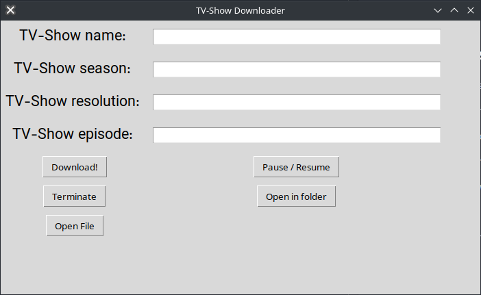

<!-- # TV-Show-Downloader
I was a little lazy in downloading the series I wanted. So I made it automatic.

## How to use
- Download or clone the project
- Go to the project folder and type `pip install -r requirements.txt`
- Then add your download path in config.json
- Type `python3 main.py` in command line and run the project
- Enjoy! -->


<h1 align="center">
  <br>
  <a href="https://github.com/shayan-azizi/tv-show-downloader"></a>
  <br>
  TV-Show-Downloader
  <br>
</h1>

<h4 align="center">A minimal Web scrapper to download TV-shows.</h4>

<p align="center">
  <a href="#key-features">Key Features</a> •
  <a href="#how-to-use">How To Use</a> •
  <a href="#download">Download</a> •
  <a href="#related">Related</a> •
  <a href="#license">License</a>
</p>



## Key Features

* Find the requested serial link 
  - Search in iranian sites
* Find with season number and resolution
* Download after find the link
  - Download with maximum speed possible
* Cross platform
  - Windows, macOS and Linux ready.

## How To Use

To clone and run this application, you'll need [Git](https://git-scm.com) and [Python](https://python.org/downloads)  installed on your computer. From your command line:

```bash
# Clone this repository
$ git clone https://github.com/shayan-azizi/TV-Show-Downloader.git

# Go into the repository
$ cd TV-Show-Downloader

# Install dependencies
$ pip3 install -r requirements.txt

# Run the app
$ python3 app.py
```

> **Note**
> If you're using Windows command line use `python` except `python3` and `pip` except `pip3`


## Download

You can [download](https://github.com/shayan-azizi/TV-Show-Downloader/archive/refs/heads/main.zip) the latest installable version of TV-Show-Downloader for Windows, macOS and Linux.

## Emailware

TV-Show-Downloader is an [emailware](https://en.wiktionary.org/wiki/emailware). Meaning, if you liked using this app or it has helped you in any way, I'd like you send me an email at <shayanazizi1386@gmail.com> about anything you'd want to say about this software. I'd really appreciate it!

## Related

[Download-Manager](https://github.com/hooman734/Download-Manager)
## Support

Just leave start! <3

## You may also like...

- [Download-Manager](https://github.com/hooman734/Download-Manager) - A download manager using tkinter and python


## License

GNU LESSER GENERAL PUBLIC LICENSE


---

> GitHub [@shayan-azizi](https://github.com/shayan-azizi) &nbsp;&middot;&nbsp;
> Twitter [@ShayanAzizi12](https://twitter.com/ShayanAzizi12)

